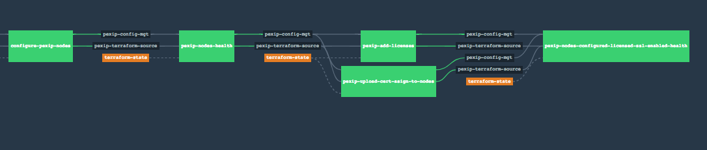

Repo Pre-Requisites and Working –

This repo has collection of POSTMAN scripts usually tested by QA team, that basically triggers the proper use-cases to configure certain functionalities of Pexip  whenever a push
event occurs in github.

Reading tfstate (terraform state) files created from parent project (Pexip-Infrastructure-and-Configuration) - This stage reads and scan the terraform state files and uses different parameters such as IPs, UserName, Password, Gateway, and others.
At this stage, Typescript code will read the inventory of all Pexip Infrastructure available whether created by Pexip repo or from host project, and then repo will configure the
conferenceing nodes requested in the configuration file: api/config/infraconfig.json

Starting POSTMAN script –At this stage, concourse pipeline runs the POSTMAN script for an environment with respect to given use-cases. For a given environment, QA team will provide the tested scripts and that will be used to configure various use-cases of Pexip.
Bootstrapping of conference nodes are performed at this stage too. The node.js NEWMAN package is used to run the POSTMAN scripts. POSTMAN scripts, in essence, make REST calls to pex-manager APIs and pexip-conference nodes APIs.
This repo has files *-collection.json. These are POSTMAN script and the name of these files indicates the functionality/usecase they run.

HealhCheck and Functionalty Stage Testing - At this stage, typescript code runs to do the various healthcheck and functionality testing. Usually, the REST calls are made to pexip-manager node to check various
configurations. Depending upon the reqiurement, POSTMAN script can check the health/functionality itself or a separate typescript does that.

Workflow -
Whole pipeline works on the feature/ environment branch, whenever the developer creates a feature branch from master branch and push changes on the feature branch. It
triggers the respective pipeline of Pexip environment.

Running Pipeline –
In this  section, it is  important to watch and examine the various job nodes that are finishing of the pipeline. And, also proper review of of POSTMAN run-report should be done. This will assure that the Pexip environment is
configured and healthy. Usually, if all the nodes in the pipeline are green; it indicates Pexip environment is running well.

